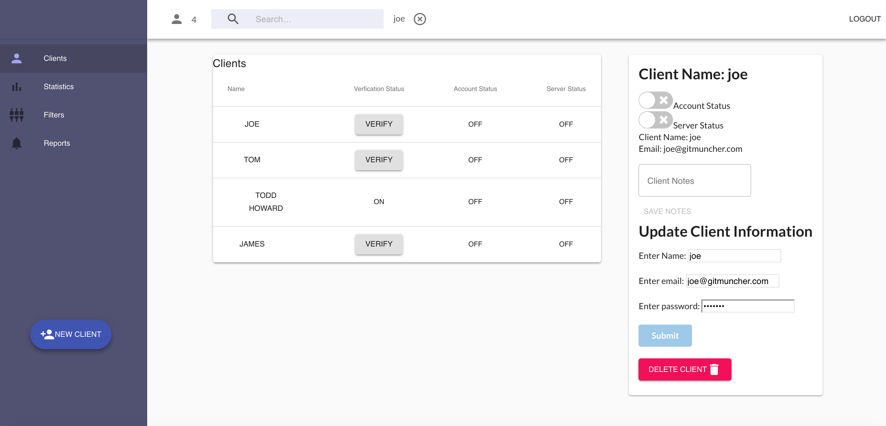
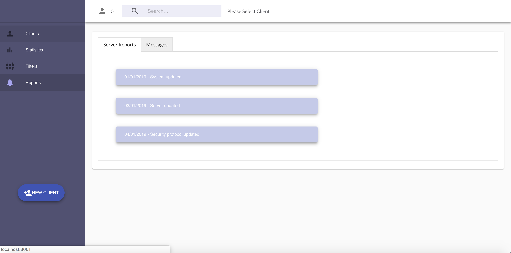
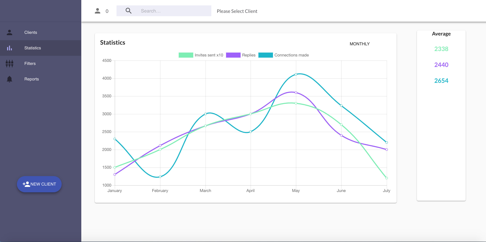
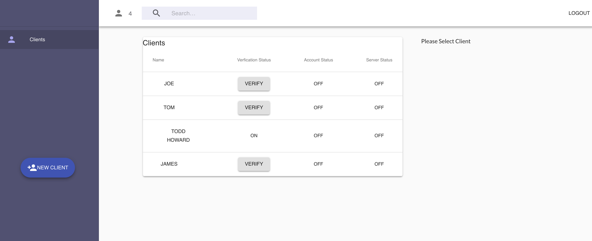
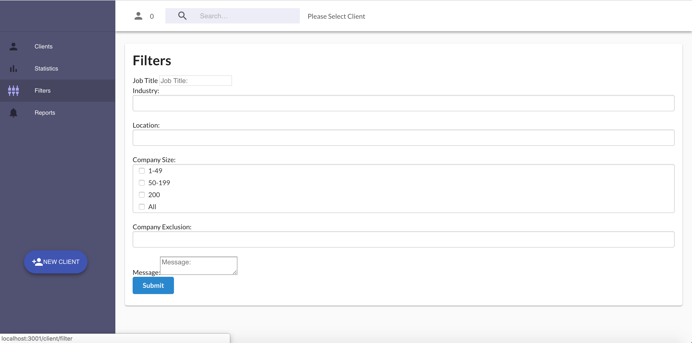

# Socialmindr CMS
----

### Collaborators

[Ryan Sickle](https://github.com/oephi)

[Steven Vi](https://github.com/estvii)

[Allan Gao](https://github.com/e3cd)

### [Socialmindr CMS Website Link](http://myspamtool.com.s3-website-ap-southeast-2.amazonaws.com/)

### Github Repository

[https://github.com/oephi/socialmindrCMS-backend](https://github.com/oephi/socialmindrCMS-backend)  
  -used to generate dummy data for front end React application.

As per the request from the client, access to the Frontend repository is has been made strictly limited to the contributors of the project, SocialMindr developers and Garret Blankenship (Lead Instructor of Coder Academy)

### Problem definition / Purpose

This repository comprises of the backend/database portion of a Full-stack web application built and deployed for a real world client as part of the final assessment for the Coder Academy Bootcamp. Our client is [SocialMindr](https://socialmindr.com/), a Sydney based startup specialising in social media automation   

Our goal was to build a dashboard/crm for the internal management of clients in the form of a Web Application. The dashboard will allow for SocialMindr to internally monitor clients lead automation activity.  

### Functionality/Features

The features of the SocialMindr dashboard include:
  
* The creation of authenticated clients accessed by SocialMindr authenticated accounts only
* The ability for SocialMindr to access and monitor internal client statuses and change credentials
* Allow for client verification through a a valid pin code generation and submission
* Visualise accumulated client automation statistics through a graph  
* Optimise client lead automation through a filter form
* A page which renders a log of server reports and a message form to document server reports

### Screenshots














### Tech stack

* HTML
* CSS
* JavaScript
* Express
* MongoDB/Mongoose
* React.js
* Node.js
* Redux
* Heroku (Frontend deployment)
* AWS (Backend deployment
* Material-ui 
* Semantic-ui


### Using the App

If you would like to make changes to the code for the backend, you can fork the repo or on your terminal, or navigate to a directory where you would like to save the app directory. To do this run the command line
```
git clone https://github.com/oephi/socialmindrCMS-backend

```
Navigate to the directory with the following command ``` cd socialmindrCMS-backend ```and run the following command to install the necessary npm packages in each directory
```
npm install
```
Create a new database by running
```
mongod --config /usr/local/etc/mongod.conf
```
For a better database visualisation it is recommended to use [MongoDB Atlas](https://www.mongodb.com/cloud/atlas)

Lastly, run  ``` npm start ``` to run the express server on your local machine at localhost:3000. 


## Design Documentation

---
#### Design Process
Our design process was quite easy because our client had already created a wireframe and a mockup design of exactly what they wanted.  Colour scheme, component look and feel had all been pre-designed by their graphics department.  

After this, there was a lot of back and forth between our team and theirs in regards to their workflow and what data tables their app would require.  Once we understood how their application was to work, out team sat down to discuss how we see their work flow, figure out if there are any gaps, and then began the building process.

---
#### User Stories
- As a user I need to be able to log.  
- As a user I need to be able to create a client.  
- As a user I need to be able to have access to a list of all clients.  
- As a user I need to be able to select and individual user and see their.
- As a user I need to be able to change a clients information  
- As a user I need to be able to verify a client.  
- As a user I need to be able to change a clients information.  
- As a user I need to be able to have access to the statistics of a client.  
- As a user I need to be able to have access to the server messages and logs a client.  
- As a user I need to be able leave server messages for records.  
- As a user I need to be able to logout


----
### User Journey


----
#### Wireframes


  

### Data Flow

---

****

## Details of Project Management & Planning process

___


___
####Client Meetings

####Meeting #1 - Introductions
Location: SocialMindr office 

Date/Time: Wednesday 15th Jan 2018 | 6:30pm - 7:30pm

Attendees: 

* Ryan Sickle - CoderAcademy
* Steven Vi - CoderAcademy
* Alan Gao - CoderAcademy
* Andrew (Founder) - SocialMindr 
* David(Developer) - SocialMindr

Apologies:

* Dan (Developer) - SociaMindr

Minutes: 

* Introduction to the team and basic house keeping
* Establishing communication plans between the two parties, communications to be done via slack. SocialMindr to invite CoderAcademy into their private chat - **Action - SocialMindr**
* Scope of works to be fleshed out by SocialMindr and issued to CoderAcademy - **Action - SocialMindr**
___
####Meeting #2 - Defining Scope of Works
Location: SocialMindr office 

Date/Time: Wednesday 15th Jan 2018 | 6:30pm - 7:30pm

Attendees: 

* Ryan Sickle - CoderAcademy
* Steven Vi - CoderAcademy
* Alan Gao - CoderAcademy
* Andrew (Founder) - SocialMindr 
* David(Developer) - SocialMindr
* Dan (Developer) - SociaMindr

Minutes: 

* Sprint planning developed by SocialMindr
* As per project brief and sprint planning, CoderAcademy is to develop both front and back end systems  - **Action CoderAcademy**
* SocialMindr to develop a bridge to connect their systems (AWS) to CoderAcademy backend/frontend system - **Action SocialMindr**
* Private GitHub repository to be established - **Action - SocialMindr**
* Sprint Trello board  - **Action - SocialMindr**
* Front and Back End specifics/feature trello board setup - **Action CoderAcademy**
___
####Meeting #3 - Client Feedback
Location: SocialMindr office 

Date/Time: Friday 25th Jan 2018 | 2:00pm - 3:00pm

Attendees: 

* Ryan Sickle - CoderAcademy
* Steven Vi - CoderAcademy
* Alan Gao - CoderAcademy
* Andrew (Founder) - SocialMindr 
* Karan(Founder) - SocialMindr

Apologies:

* Dan (Developer) - SociaMindr
* David (Developer) - SocialMindr

Minutes: 

* Project status update to SocialMindr on the work that has been done
* Feedback has been positive with the work produced.
* Scope of works have been updated in order to accomodate SocialMindr's feedback, the following below will added by CoderAcademy: - **Action CoderAcademy**

  * add feature to update a client's information on the client status component

  * add feature to delete client on client status component

  * toggling account status off will turn off server status 

  * company size field to be able to select multiple options

  * search bar, will filter out clients based as a user types in it

  * client status component needs to be sticked 

* Information about the SocialMindr's AWS system needs to be provided to CoderAcademy - **Action - SocialMindr**

* If time permits SocialMindr wishes to have CoderAcademy to deploy to a domain name purchased by SocialMindr - **Action - CoderAcademy**
___

##  Short Answer Questions


#### What are the most important aspects of quality software?

The important aspects of quality software are reliability, efficiency, security and maintainability.  Reliability is a measurement of an applications resiliency and structural solidity. Efficiency is a measurement of how peformant an application is once in run-time mode.  This is especially important for applications in high speed environments such as algorithmic and transactional processing.  Security is a measure of the likelihood of potential security breaches due to poor coding practices and architecture.  And finally, maintainability includes the notion of adaptability, portability and transferability.  This indicates how scalable the code is, and how seamless the structure and coherence is of the code is when transferred between teams


#### What libraries are being used in the app and why?

The mian libraries being used in this application are React and ExpressJS.  React is being used due to it's complete ecosystem and ease of use in getting and application up and running quickly on the fronend.  ExpressJS is being used on the backend due to its ease of use and concise usages of npm packages.  It is a barebones backend library that allows for a modular design via the implementation of npm packages.  We also used Redux to abstract state management away from any parent/child relations, making it easier to access properties anywhere in our application.

A few of the npm packages being used are:

axios - to handle http requests
celebrate -  to handle validation on the routes
mongoose - to handle interaction with mongoDB
passport - to handle user validation
jsonwebtoken - to handle the creation of unique token to be used for client authentication
express-session - to help handle the manipulaiton of session information


#### A team is about to engage in a project, developing a website for a small business. What knowledge and skills would they need in order to develop the project?

They would need knowledge of web design and web technology concepts.  They'd need to understand how the web works and how the interface that users interact with talks to the internet.  This includes the understanding of the language of the web and the language of any framework required for the build process of the application and deployment to production

They would need good communication skills to be able to map out what the clients needs really are.  They need to be able to ask enough questions to allow a natural unfoldment of the clients wantings in regards to their application.  Communication is also important in being able to keep the client up to date with the development of the application during the lifecycle.

They would need good time and project management skills for the application to hit the target.  This can include knowledge of Agile and the employment of sprints to help structure the workflow.  Project management software like Trello or KanBan Flow can be use to help with this.


#### Within your own project what knowledge or skills were required to complete your project, and overcome challenges?

We needed to understand RESTful web conventions to communicate with the web using HTTP requests and how to employ that knowledge inside of ExpressJS and React.  We needed to know how to interact with a no-sql database (MongoDB).   We need to know how to integrate both the front and back end technologies together.  Communication was really important, we had to know where each person was, if they needed help and if they were on track.  When we found errors we worked together to understand what the problem was, where it was located and what was required to fix the issue.  Communication also came into play to keep morale up.  When things seemed like they were coming to standstill or something just wasn't happening, it's important to not get down about it, not let it cloud your judgement and just take a step back to allow things to reset.


#### Evaluate how effective your knowledge and skills were this project, using examples, and suggest changes or improvements for future projects of a similar nature?

Each of us has strengths and weaknesses and during development we all leaned into our strengths while also doing some to strengthen our weakness.  For example, Ryan is strong in the backend but not as useful at the front.  So after he had completed enough on the backend he had a crack at a few components at the front, which he found frustrating but totally satisfying once he figured out what the hell was going on.  So for him, strengthening his front end skills would be beneficial for future projects.

As a team our knowledge for this project was spot on.  While we didn't know everything, we knew enough and had enough resources to know how to get to the end goal.


