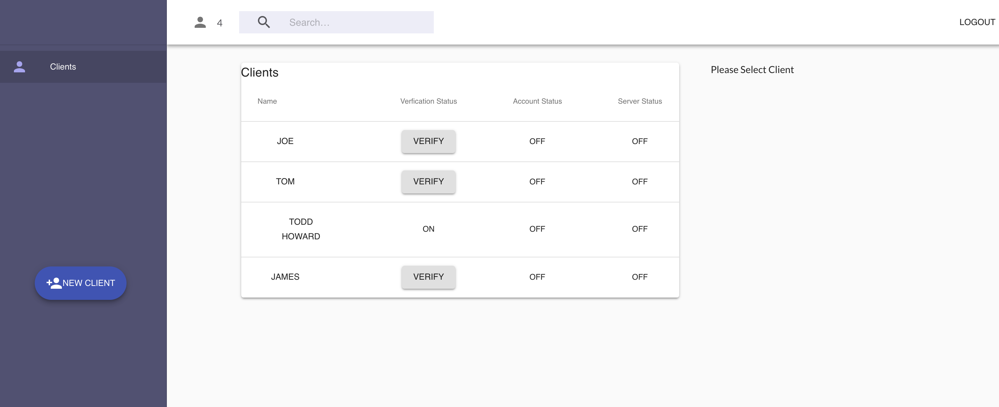
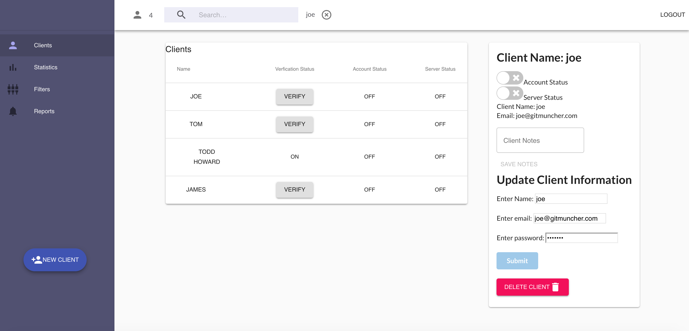
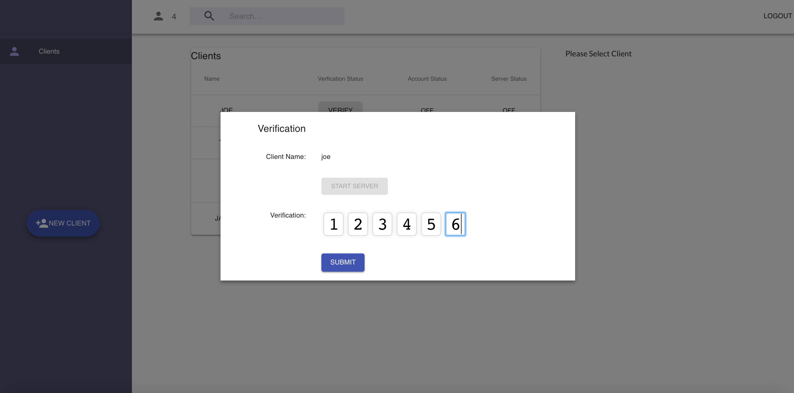
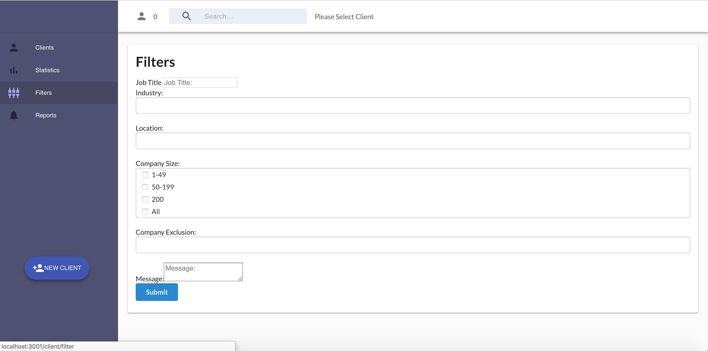
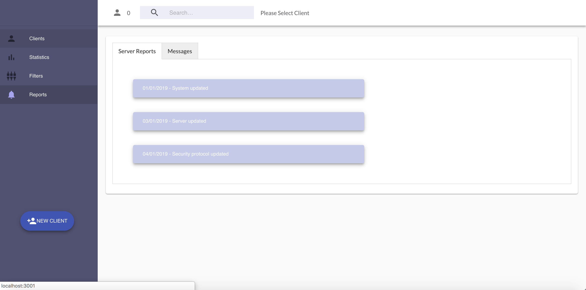
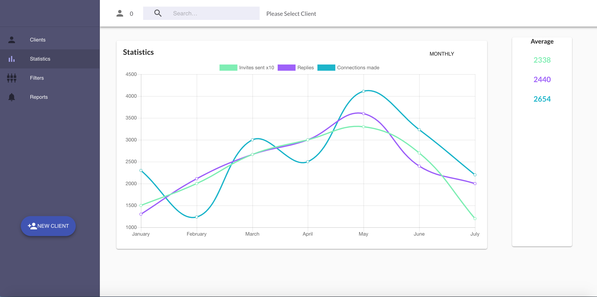
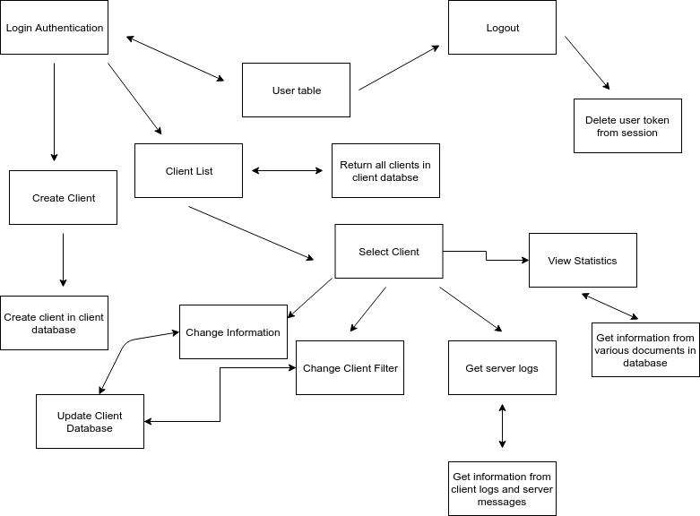

# Socialmindr
----
##Design Documentation

###Design Process
Our design process was quite easy because our client had already created a wireframe and a mockup design of exactly what they wanted.  Colour scheme, component look and feel had all been pre-designed by their graphics department.  

After this, there was a lot of back and forth between our team and theirs in regards to their workflow and what data tables their app would require.  Once we understood how their application was to work, out team sat down to discuss how we see their work flow, figure out if there are any gaps, and then began the building process.

###User Stories
- As a user I need to be able to log.  
- As a user I need to be able to create a client.  
- As a user I need to be able to have access to a list of all clients.  
- As a user I need to be able to select and individual user and see their.
- As a user I need to be able to change a clients information  
- As a user I need to be able to verify a client.  
- As a user I need to be able to change a clients information.  
- As a user I need to be able to have access to the statistics of a client.  
- As a user I need to be able to have access to the server messages and logs a client.  
- As a user I need to be able leave server messages for records.  
- As a user I need to be able to logout

----
###Wireframes
Client List

Client Status

Client Verification

Filter for clients

Server Logs

Statistics

### Data Flow

****

##  Short Answer Questions

####What are the most important aspects of quality software?

The important aspects of quality software are reliability, efficiency, security and maintainability.  Reliability is a measurement of an applications resiliency and structural solidity. Efficiency is a measurement of how peformant an application is once in run-time mode.  This is especially important for applications in high speed environments such as algorithmic and transactional processing.  Security is a measure of the likelihood of potential security breaches due to poor coding practices and architecture.  And finally, maintainability includes the notion of adaptability, portability and transferability.  This indicates how scalable the code is, and how seamless the structure and coherence is of the code is when transferred between teams

####What libraries are being used in the app and why?

The mian libraries being used in this application are React and ExpressJS.  React is being used due to it's complete ecosystem and ease of use in getting and application up and running quickly on the fronend.  ExpressJS is being used on the backend due to its ease of use and concise usages of npm packages.  It is a barebones backend library that allows for a modular design via the implementation of npm packages.  We also used Redux to abstract state management away from any parent/child relations, making it easier to access properties anywhere in our application.

A few of the npm packages being used are:

axios - to handle http requests
celebrate -  to handle validation on the routes
mongoose - to handle interaction with mongoDB
passport - to handle user validation
jsonwebtoken - to handle the creation of unique token to be used for client authentication
express-session - to help handle the manipulaiton of session information

A team is about to engage in a project, developing a website for a small business. What knowledge and skills would they need in order to develop the project?

They would need knowledge of web design and web technology concepts.  They'd need to understand how the web works and how the interface that users interact with talks to the internet.  This includes the understanding of the language of the web and the language of any framework required for the build process of the application and deployment to production

They would need good communication skills to be able to map out what the clients needs really are.  They need to be able to ask enough questions to allow a natural unfoldment of the clients wantings in regards to their application.  Communication is also important in being able to keep the client up to date with the development of the application during the lifecycle.

They would need good time and project management skills for the application to hit the target.  This can include knowledge of Agile and the employment of sprints to help structure the workflow.  Project management software like Trello or KanBan Flow can be use to help with this.

####Within your own project what knowledge or skills were required to complete your project, and overcome challenges?

We needed to understand RESTful web conventions to communicate with the web using HTTP requests and how to employ that knowledge inside of ExpressJS and React.  We needed to know how to interact with a no-sql database (MongoDB).   We need to know how to integrate both the front and back end technologies together.  Communication was really important, we had to know where each person was, if they needed help and if they were on track.  When we found errors we worked together to understand what the problem was, where it was located and what was required to fix the issue.  Communication also came into play to keep morale up.  When things seemed like they were coming to standstill or something just wasn't happening, it's important to not get down about it, not let it cloud your judgement and just take a step back to allow things to reset.

####Evaluate how effective your knowledge and skills were this project, using examples, and suggest changes or improvements for future projects of a similar nature?

Each of us has strengths and weaknesses and during development we all leaned into our strengths while also doing some to strengthen our weakness.  For example, Ryan is strong in the backend but not as useful at the front.  So after he had completed enough on the backend he had a crack at a few components at the front, which he found frustrating but totally satisfying once he figured out what the hell was going on.  So for him, strengthening his front end skills would be beneficial for future projects.

As a team our knowledge for this project was spot on.  While we didn't know everything, we knew enough and had enough resources to know how to get to the end goal.

